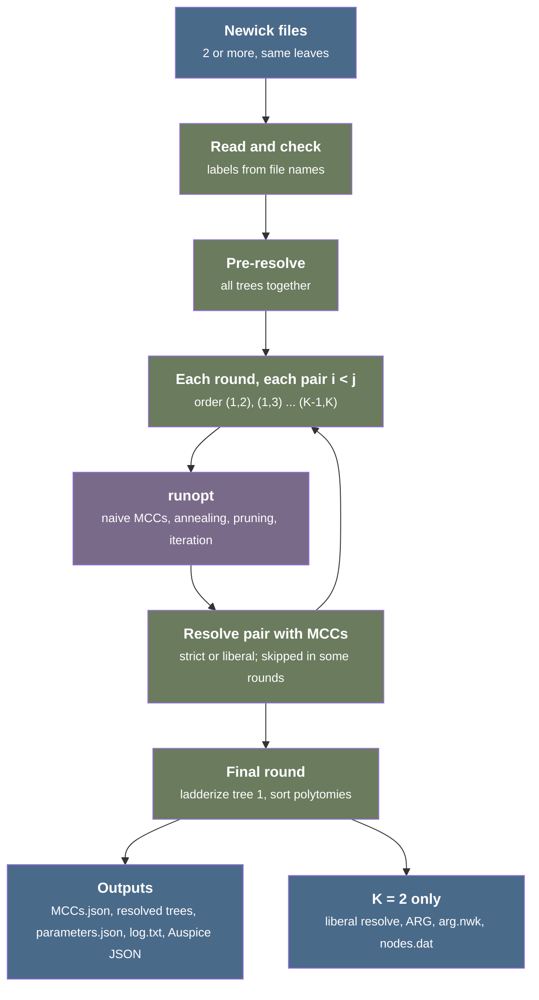

# TreeKnit.jl: overview and feature inventory

The documents in `kb/feat/v0/` describe what TreeKnit.jl, the reference implementation, does. Each document states the behavior of the code, with links to the source. Where the code differs from the TreeKnit.jl documentation, the code is the reference, and [`documented-vs-actual.md`](documented-vs-actual.md) lists the differences.

Surveyed revision: TreeKnit.jl `master` at [`dbbc89a`](https://github.com/PierreBarrat/TreeKnit.jl/commit/dbbc89ac691fed0949a622eedbae103787b89320) (2025-02-18). This is TreeKnit.jl 0.5.8 (2024-08-09) plus one command-line fix for Julia 1.11 and documentation changes. The Newick reading, writing, and split operations come from TreeTools.jl 0.6.14 (2024-10-25) [[src](https://github.com/PierreBarrat/TreeTools.jl/tree/2fb33ac3a5891a9cf0d25c76d2bc0270e571a6b8)], the latest version that the TreeKnit.jl compatibility bound (`0.6.13`) allows.

## What TreeKnit does

Segmented viruses, for example human influenza, exchange segments when two strains infect the same host. This exchange is a **reassortment**. Each segment has its own genealogy, so a phylogenetic tree built from one segment can differ from a tree built from another segment. TreeKnit takes one tree per segment, all with the same leaves, and finds where the trees differ because of reassortment.

- **Maximally compatible clade (MCC)**: a set of leaves whose subtrees have the same topology in both trees of a pair, up to polytomy resolution, and that cannot be made larger. Inside an MCC, both segments share the branches, so no reassortment occurred there. The root of each MCC marks one reassortment, except for an MCC that contains the root of a tree. The other documents use this definition
- **Topological heuristic**: TreeKnit finds the MCCs from the tree topologies and reads no sequences. It removes groups of leaves from the trees to make the remaining parts compatible. Each removal costs $\gamma$, and the score counts the topological mismatches that remain. A simulated annealing search finds the removals with the lowest score. Branch lengths break ties between configurations with the same score
- **Polytomy resolution**: trees built from short segments have polytomies. Two trees can differ only because one tree is less resolved. TreeKnit adds compatible splits from one tree to the other before and during inference, and uses the inferred MCCs to add more splits after inference
- **More than two trees**: for $K > 2$ trees, TreeKnit infers the MCCs of every pair in a fixed order and can resolve the trees between pairs. It does not make the MCCs of different pairs consistent with each other
- **Ancestral reassortment graph (ARG)**: for exactly two trees, TreeKnit joins the trees along the MCCs into one graph with a hybrid node above each reassortment and writes it as extended Newick

The method is published in Barrat-Charlaix, Vaughan, and Neher 2022, "TreeKnit: Inferring ancestral reassortment graphs of influenza viruses", _PLOS Computational Biology_ 18:e1010394, <https://doi.org/10.1371/journal.pcbi.1010394>, with a preprint at <https://doi.org/10.1101/2021.12.20.473456> [[doc](https://github.com/PierreBarrat/TreeKnit.jl/blob/dbbc89ac691fed0949a622eedbae103787b89320/README.md?plain=1#L8-L13)]. The paper covers two trees. On simulated genealogies with 100 leaves, it reports TreeKnit about as accurate as the Bayesian method CoalRe, with a runtime of 40 ms per tree pair against several hours for CoalRe (see [`treeknit-paper-vs-code.md`](../../reports/treeknit-paper-vs-code.md)).

## Terms

- **Split**: the set of leaves below one internal node of a tree
- **Polytomy**: an internal node with more than two children. Resolving a polytomy adds a split below it
- **Compatible split**: a split that, for every split of a tree, either contains it, is contained in it, or has no leaf in common with it, so that the tree can take it
- **LCA**: lowest common ancestor, the deepest node above a set of leaves
- **Naive MCC**: a largest clade with exactly the same topology in both trees, found without removing any leaf
- **Coarse-grained leaf**: one naive MCC replaced by a single leaf before the annealing. The cost $\gamma$ applies to each removed coarse-grained leaf
- **Configuration**: the set of coarse-grained leaves that stay in the trees during the annealing
- **Tanglegram**: a drawing of two trees facing each other, with a line between the two copies of each leaf
- **Extended Newick**: a Newick string in which a node with two parents appears once per parent, marked with `#`

## Data flow of one command-line run

## Documents

- [`cli.md`](cli.md): the `treeknit` command, its arguments, options, flags, validation, logging, and output directory
- [`pipeline.md`](pipeline.md): `OptArgs`, the two run methods, rounds, the pair order, tree mutation, naive mode, and the parallel mode
- [`mcc-inference.md`](mcc-inference.md): naive MCCs, the split graph, the energy, simulated annealing, the branch-length likelihood, and the iteration in `runopt`
- [`resolution.md`](resolution.md): polytomy resolution with tree topology only, during inference, and with MCCs (strict and liberal)
- [`arg.md`](arg.md): construction of the ancestral reassortment graph for two trees and its extended Newick format
- [`visualization.md`](visualization.md): ladderizing, sorting polytomies for tanglegrams, Auspice JSON, and ARG viewers
- [`formats.md`](formats.md): every input and output file format, including the Newick dialect of TreeTools.jl
- [`julia-api.md`](julia-api.md): the Julia library interface, `MCC_set`, and the MCC utility functions
- [`documented-vs-actual.md`](documented-vs-actual.md): the defects of TreeKnit.jl and the places where the code does not do what the documentation or the help text says. The other documents link to it instead of repeating these items
- [`history.md`](history.md): features by release, removed features, unmerged branches, and upstream pull request #42

Research reports in `kb/reports/` give the scientific and technical context:

- [`treeknit-paper-vs-code.md`](../../reports/treeknit-paper-vs-code.md): each part of the published method compared with the code, including the divergences in the likelihood test and the extensions without published validation
- [`reassortment-methods-literature.md`](../../reports/reassortment-methods-literature.md): other reassortment and network methods, the benchmarks that include TreeKnit, and the combinatorial problems behind it
- [`treeknit-ecosystem.md`](../../reports/treeknit-ecosystem.md): distribution, downstream users, and the conformance of the output files to Auspice and extended Newick readers

## Position among related tools

- **Speed and input**: TreeKnit needs only two or more rooted trees with the same leaves. It needs no alignments and runs in milliseconds to seconds. CoalRe, a Bayesian method, takes hours, and TreeSort needs alignments
- **Accuracy in later benchmarks**: three independent studies compare TreeKnit with other methods (see [`reassortment-methods-literature.md`](../../reports/reassortment-methods-literature.md)):
  - TreeSort is more accurate on 1,000 or more strains ([Markin et al. 2025](https://doi.org/10.1093/molbev/msaf133))
  - TreeKnit and CoalRe get the number of reassortments right in 15% to 45% of simulations with 50 tips ([Lin et al. 2024](https://doi.org/10.1093/molbev/msae078))
  - TreeKnit has low precision on noisy trees ([Cai et al. 2026](https://doi.org/10.1093/nar/gkag255))
- **Users**: four public repositories run the `treeknit` command. Only one of them, a Nextstrain seasonal-flu rule that no workflow includes, expects the output names of TreeKnit 0.4. TreeTime `arg` reads the 0.4 MCC file format (see [`treeknit-ecosystem.md`](../../reports/treeknit-ecosystem.md))

## Outside the scope of TreeKnit

The code has no implementation of the items below. A user must do these steps with other tools.

- **Tree inference**: TreeKnit does not build trees from sequences or alignments
- **Rooting**: TreeKnit uses the input roots as they are. The documentation tells users to root all trees with the same outgroup [[doc](https://github.com/PierreBarrat/TreeKnit.jl/blob/dbbc89ac691fed0949a622eedbae103787b89320/docs/src/overview.md?plain=1#L32-L33)]
- **Removal of weak branches**: every internal node is a hard topological constraint. The documentation tells users to collapse branches shorter than $(L/2)^{-1}$, where $L$ is the sequence length, or with low bootstrap support before the run [[doc](https://github.com/PierreBarrat/TreeKnit.jl/blob/dbbc89ac691fed0949a622eedbae103787b89320/docs/src/overview.md?plain=1#L29-L30)]
- **Reproducible runs**: no option sets a random seed (see [`documented-vs-actual.md`](documented-vs-actual.md))
- **ARG for more than two trees**: only pairs. An unmerged branch has a prototype (see [`history.md`](history.md))
- **Consistency between pairs**: for $K > 2$, the MCCs of different pairs can contradict each other. The documentation shows such a case and states that TreeKnit cannot fix it [[doc](https://github.com/PierreBarrat/TreeKnit.jl/blob/dbbc89ac691fed0949a622eedbae103787b89320/docs/src/multitreeknit.md?plain=1#L96-L123)]
- **Reading results back**: no function reads `MCCs.json` or an ARG file. `read_mccs` reads only the line-based MCC list (see [`formats.md`](formats.md))
